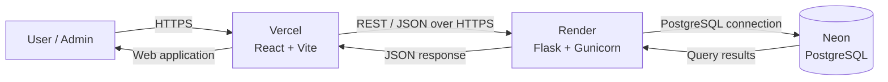
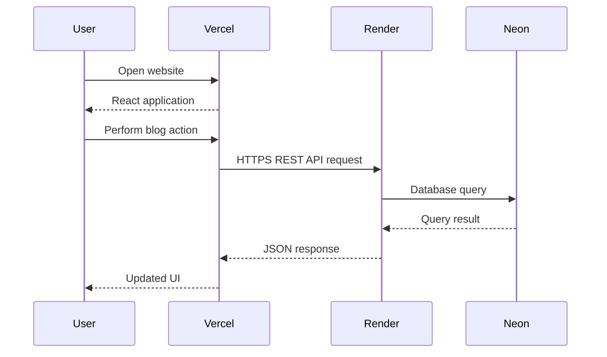
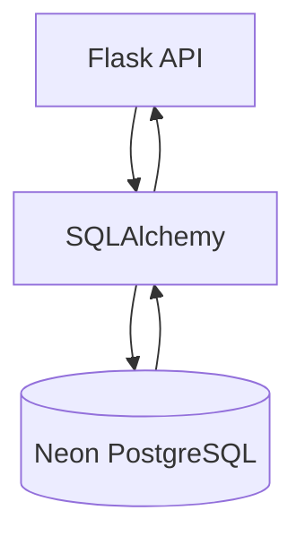
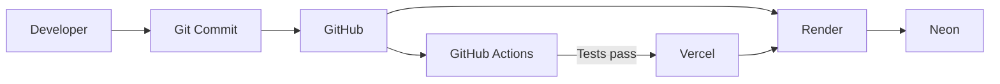
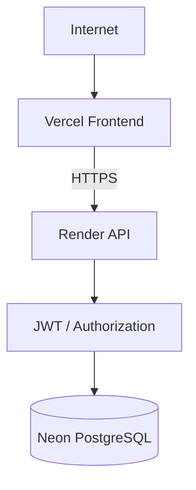
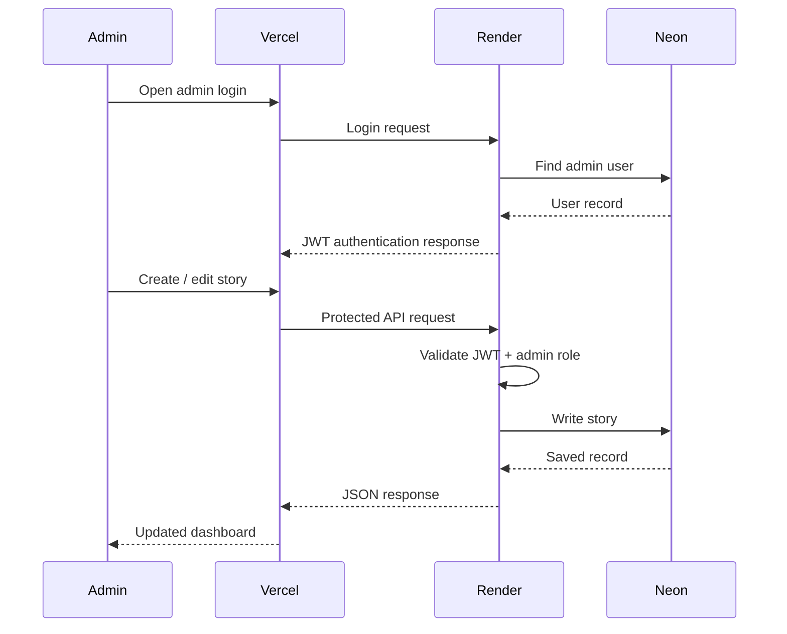
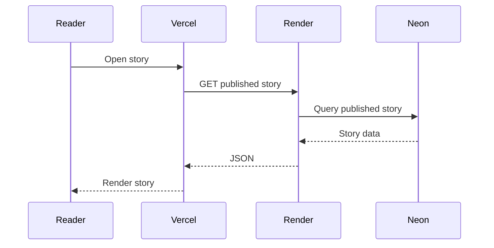

# Zero to Hero Blogs — Deployment Architecture

## 1. Production Deployment Overview



The production application is split into independently deployed frontend,
backend, and database services.

---

## 2. Deployment Responsibilities

| Service | Responsibility |
|---|---|
| Vercel | Hosts the React/Vite frontend |
| Render | Runs the Flask backend API |
| Neon | Hosts the PostgreSQL production database |
| GitHub | Source-code repository and CI workflow |

The frontend and backend are deployed independently.

The database is managed separately from both application services.

---

## 3. Production Request Flow



---

## 4. Frontend Deployment

The frontend is a React application built with Vite.

### Production build

The production frontend is generated using:

```bash
npm run build
```

The resulting build is deployed to Vercel.

### Frontend responsibilities

- Render public pages
- Render admin pages
- Manage client-side routing
- Communicate with the backend API
- Display loading states
- Display error states
- Display empty states
- Handle authentication state
- Provide responsive UI

The frontend does not directly connect to PostgreSQL.

---

## 5. Backend Deployment

The backend is a Flask REST API.

Production execution uses Gunicorn as the application server.

```text
Internet
   |
   v
Render
   |
   v
Gunicorn
   |
   v
Flask Application
   |
   +--> Routes / Blueprints
   |
   +--> Authentication
   |
   +--> Validation
   |
   +--> Services
   |
   +--> SQLAlchemy
   |
   v
PostgreSQL
```

The backend is responsible for:

- Authentication
- Authorization
- Business logic
- Validation
- CRUD operations
- Comment moderation
- Reactions
- Image uploads
- RSS
- Dashboard data
- Database communication

---

## 6. Database Deployment

Production data is stored in PostgreSQL through Neon.



The frontend never connects directly to the database.

All database access goes through the backend API.

---

## 7. Environment Variables

Environment-specific configuration is kept outside the source code.

### Backend examples

```text
DATABASE_URL
JWT_SECRET_KEY
ADMIN_PASSWORD
```

### Frontend examples

```text
VITE_API_URL
```

The exact environment-variable names should match the project's `.env.example`
files.

Secrets should not be committed to Git.

---

## 8. Environment Separation

```text
                    Application Code
                          |
             +------------+------------+
             |                         |
       Development                 Production
             |                         |
        Local Flask                Render
             |                         |
       Local/Test DB              Neon PostgreSQL
             |
       Local React/Vite
             |
          Browser
```

Development and production configuration are kept separate.

---

## 9. Deployment Pipeline



The repository acts as the central source of truth.

GitHub Actions runs backend tests through the project's CI workflow.

The frontend and backend can then be deployed through their respective hosting
services.

---

## 10. Security Boundaries



Important security boundaries:

1. Browser-to-backend communication uses HTTPS.
2. Administrative API operations require authentication.
3. Administrative permissions are checked server-side.
4. Database credentials are stored as environment variables.
5. JWT secrets are stored as environment variables.
6. The browser does not receive database credentials.
7. PostgreSQL is accessed by the backend rather than directly by React.

---

## 11. Admin Deployment Flow



---

## 12. Public Reading Flow



---

## 13. Deployment Failure Boundaries

The services are separated, so failures can be isolated.

### Frontend failure

Possible effect:

```text
Vercel unavailable
        |
        v
Website UI unavailable
```

### Backend failure

Possible effect:

```text
Render API unavailable
        |
        v
Frontend loads
but API-dependent operations fail
```

### Database failure

Possible effect:

```text
Neon unavailable
        |
        v
Backend cannot complete database operations
```

This separation makes troubleshooting easier because each major layer has a
clear responsibility.

---

## 14. Deployment Checklist

### Before frontend deployment

- [ ] Frontend build succeeds
- [ ] API URL is configured
- [ ] No development-only configuration is used
- [ ] Responsive UI is verified
- [ ] Production build is generated successfully

### Before backend deployment

- [ ] Backend tests pass
- [ ] Production database URL is configured
- [ ] JWT secret is configured
- [ ] CORS configuration is correct
- [ ] Gunicorn configuration is correct
- [ ] Database migrations are available

### Before database deployment

- [ ] PostgreSQL connection is available
- [ ] Required migrations are applied
- [ ] Database credentials are not committed
- [ ] Production schema is verified

### After deployment

- [ ] Homepage loads
- [ ] Story listing works
- [ ] Story reading works
- [ ] Admin login works
- [ ] Admin authorization works
- [ ] Story creation works
- [ ] Draft/publish works
- [ ] Comment moderation works
- [ ] Image upload works
- [ ] Reactions work
- [ ] RSS works
- [ ] No secrets appear in frontend/network responses

---

## 15. Interview Explanation

A concise explanation for interviews:

> "I deployed the project as three separate production layers. The React
> frontend is hosted on Vercel, the Flask REST API runs on Render using
> Gunicorn, and PostgreSQL is hosted on Neon. The frontend communicates with
> the backend over HTTPS and never connects directly to the database.
> Environment variables hold deployment-specific configuration and secrets.
> GitHub Actions runs the backend test suite, while the frontend and backend
> can be deployed independently."

---

## 16. Architecture Summary

```text
                         INTERNET
                             |
                             v
                    +----------------+
                    |    VERCEL      |
                    | React + Vite   |
                    +----------------+
                             |
                       HTTPS / REST
                             |
                             v
                    +----------------+
                    |    RENDER      |
                    | Flask +        |
                    | Gunicorn       |
                    +----------------+
                             |
                     SQLAlchemy / SQL
                             |
                             v
                    +----------------+
                    |     NEON       |
                    |   PostgreSQL   |
                    +----------------+

              GitHub + GitHub Actions
                       |
                       +--> Source Control
                       +--> Automated Tests
```

This deployment model keeps the frontend, API, database, and source-control/CI
responsibilities clearly separated.
