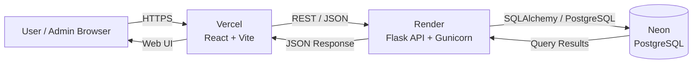
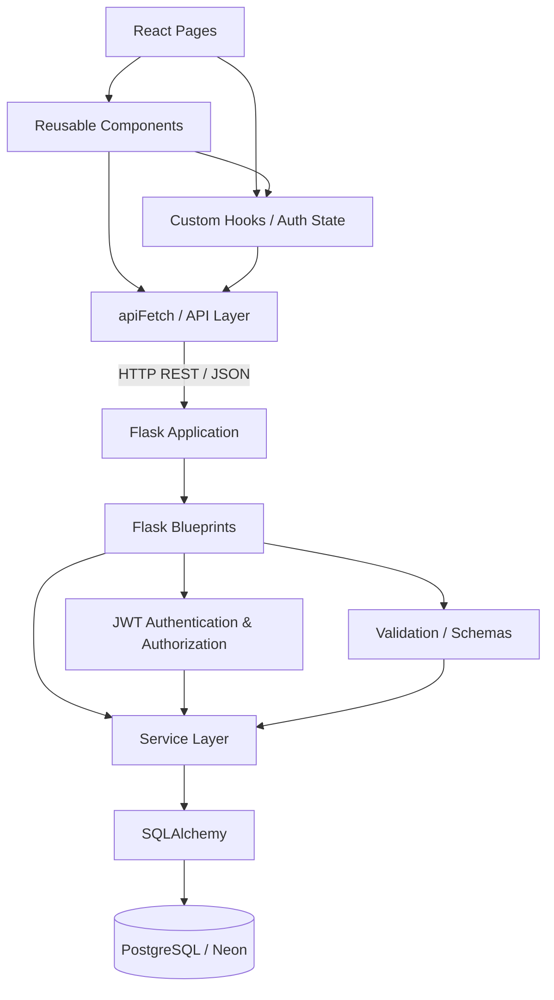
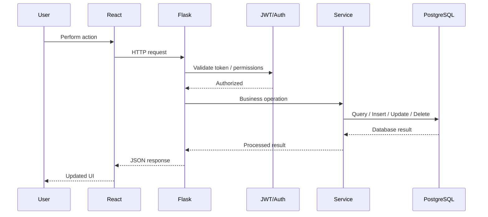
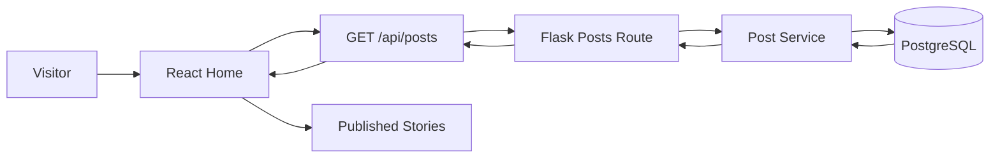
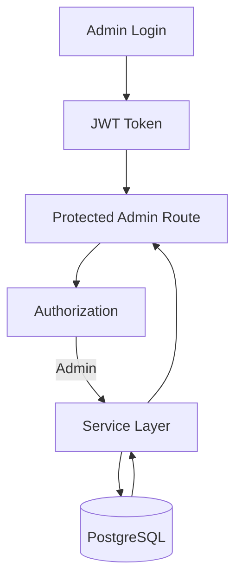
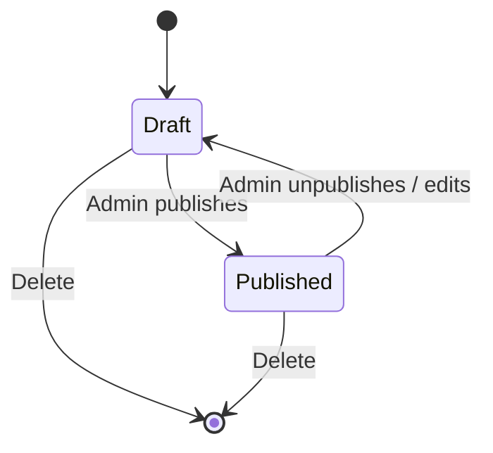
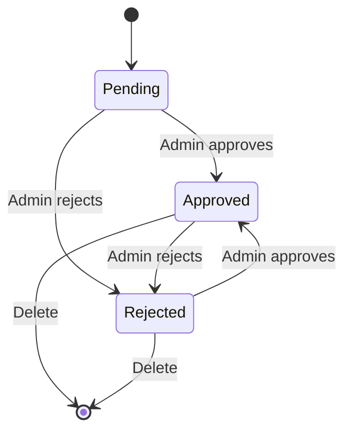
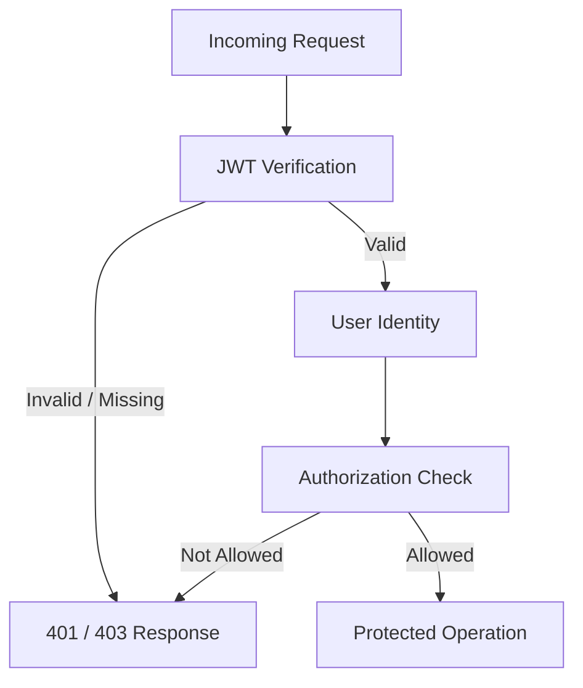
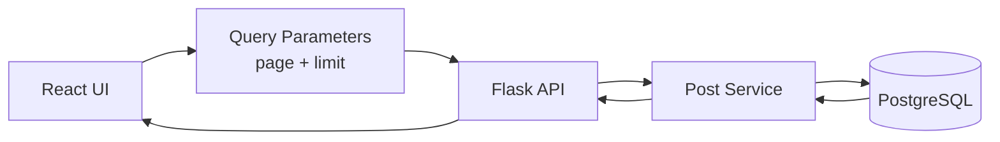
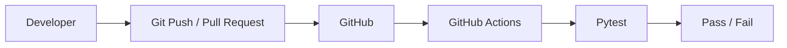

# Zero to Hero Blogs — System Architecture

## 1. Production Architecture



---

## 2. Application Architecture



---

## 3. Request Flow



---

## 4. Public Blog Flow



Public story listing uses published content for public users.

---

## 5. Admin Flow



Administrative operations include:

- Create story
- Update story
- Delete story
- Save draft
- Publish story
- Upload images
- Moderate comments
- View dashboard data

---

## 6. Draft / Publish Flow



Public users see published stories, while administrators can manage drafts and
published stories.

---

## 7. Comment Moderation Flow



New comments enter the moderation workflow before public display.

---

## 8. Frontend Structure

```text
frontend/
└── src/
    ├── components/
    │   ├── AdminCommentList
    │   ├── AdminStoryList
    │   ├── AdminStatCard
    │   ├── EmptyState
    │   ├── ErrorState
    │   ├── ImageUploader
    │   ├── LoadingState
    │   ├── Navbar
    │   ├── Pagination
    │   ├── PostCard
    │   ├── ProtectedRoute
    │   ├── RichTextEditor
    │   ├── Skeleton
    │   ├── StoryCardSkeleton
    │   ├── StoryForm
    │   └── TagInput
    │
    ├── hooks/
    │   └── useAuth
    │
    ├── pages/
    │   ├── Home
    │   ├── Post
    │   ├── CategoryPage
    │   ├── AdminLogin
    │   ├── AdminDashboard
    │   ├── CreateStory
    │   └── EditStory
    │
    └── App.jsx
```

---

## 9. Backend Structure

```text
backend/
├── app.py
├── database.py
├── models.py
│
├── routes/
│   ├── auth.py
│   ├── posts.py
│   ├── comments.py
│   ├── reactions.py
│   ├── uploads.py
│   ├── dashboard.py
│   ├── additional_stories.py
│   └── rss.py
│
├── services/
│   ├── post_service.py
│   ├── comment_service.py
│   ├── reaction_service.py
│   ├── upload_service.py
│   ├── dashboard_service.py
│   ├── additional_story_service.py
│   └── rss_service.py
│
├── schemas/
│   └── post_schema.py
│
├── serializers/
│   └── post_serializer.py
│
├── utils/
│   └── validators.py
│
├── migrations/
│   └── versions/
│
└── tests/
    ├── conftest.py
    ├── test_auth.py
    ├── test_posts.py
    ├── test_comments.py
    ├── test_reactions.py
    ├── test_upload.py
    ├── test_rss.py
    └── test_additional_stories.py
```

---

## 10. Security Architecture



The application distinguishes:

- **401 Unauthorized** — authentication is missing or invalid.
- **403 Forbidden** — the authenticated user does not have the required
  permission.

Administrative story creation, editing, deletion, uploads, and moderation are
protected by authentication and authorization.

---

## 11. Pagination Architecture



Example:

```text
GET /api/posts?page=1&limit=10
```

The API returns pagination metadata so the frontend can render navigation
controls without loading every story into the browser.

---

## 12. Testing and CI



The backend test suite covers authentication, authorization, posts, comments,
reactions, uploads, RSS, and additional stories.

---

## 13. Architectural Principles

### Separation of Concerns
HTTP routing, validation, business logic, database access, and presentation are
kept in separate layers.

### Reusability
Common frontend behavior is implemented through reusable components and hooks.

### Security
JWT authentication and role-based authorization protect administrative
operations.

### Testability
Backend behavior is covered by automated pytest tests and CI.

### Maintainability
Blueprints and service modules keep the backend modular as features grow.

### Performance
Database-level pagination and indexes reduce unnecessary data processing.

---
